# Exemple de soumission d'activité
ÉTS - LOG430 - Architecture logicielle - Été 2026

Étudiant(e) : Chris-Emmanuel Berton

# Questions
(Il est obligatoire d'ajouter du code, des captures d'écran ou des sorties de terminal pour illustrer chacune de vos réponses.)

## Question 1 : Lorsque l'application démarre, la synchronisation entre Redis et MySQL est-elle initialement déclenchée par quelle méthode ? Veuillez inclure le code pour illustrer votre réponse.
Réponse Qui appelle sync
La synchronisation Redis-MySQL  se fait par la fonction populate_redis_from_mysql() puisqu'elle est la première fonction à appeler sync_all_orders_to_redis

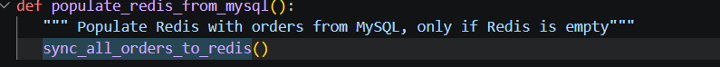
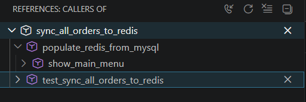

## Question 2 : Quelles méthodes avez-vous utilisées pour lire des données à partir de Redis ? Veuillez inclure le code pour illustrer votre réponse.

La lecture des données par le Redis se fait à partir de la fonction get_orders_from_redis

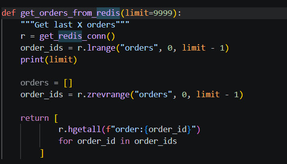

## Question 3 : Quelles méthodes avez-vous utilisées pour ajouter des données dans Redis ? Veuillez inclure le code pour illustrer votre réponse.
L'ajout des données se fait par la fonction add_order_to_redis. Ladite fonction se fait appeler par add_order

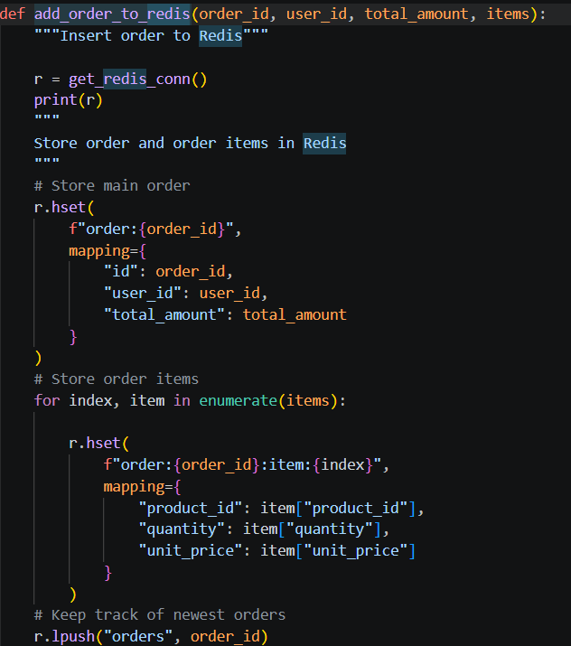

## Question 4 : Quelles méthodes avez-vous utilisées pour supprimer des données dans Redis ? Veuillez inclure le code pour illustrer votre réponse.
La suppression des données se fait par la methode delete_order_from_redis, la méthode étant appelée par delete_order

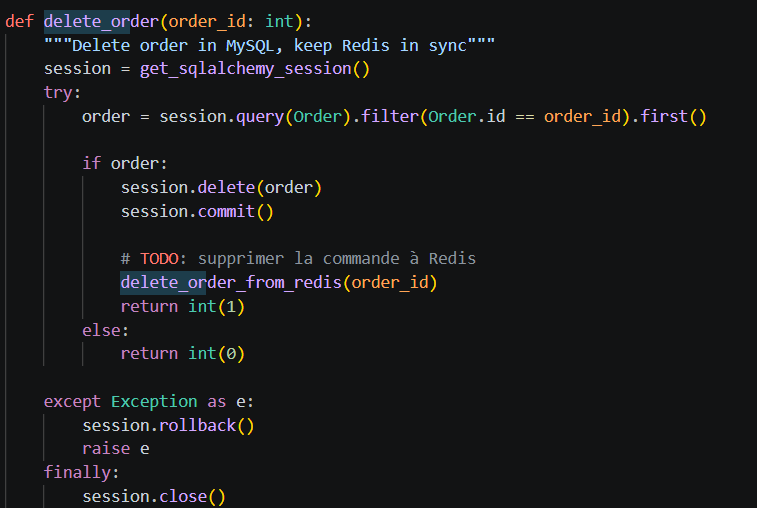
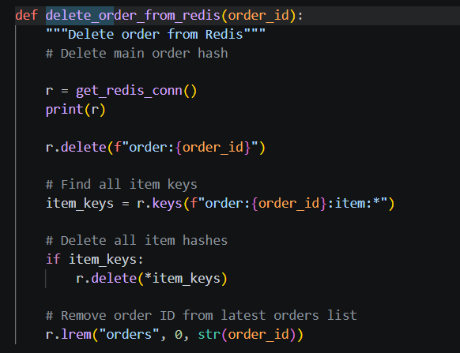

 ## Question 5 : Si nous souhaitions créer un rapport similaire, mais présentant les produits les plus vendus, les informations dont nous disposons actuellement dans Redis sont-elles suffisantes, ou devrions-nous chercher dans les tables sur MySQL ? Si nécessaire, quelles informations devrions-nous ajouter à Redis ? Veuillez inclure le code pour illustrer votre réponse.

Oui : les informations sur la commande permettent de déduire autant les plus grand acheteurs en liant les id au total dépensé en commande que les articles les plus vendus en liant les if des produits à leurs quantité. Dans les deux scénarios, l'information interprétée reste le OrderItem.

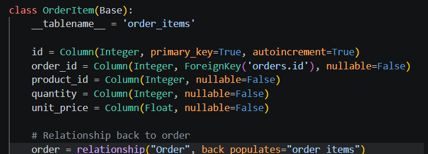

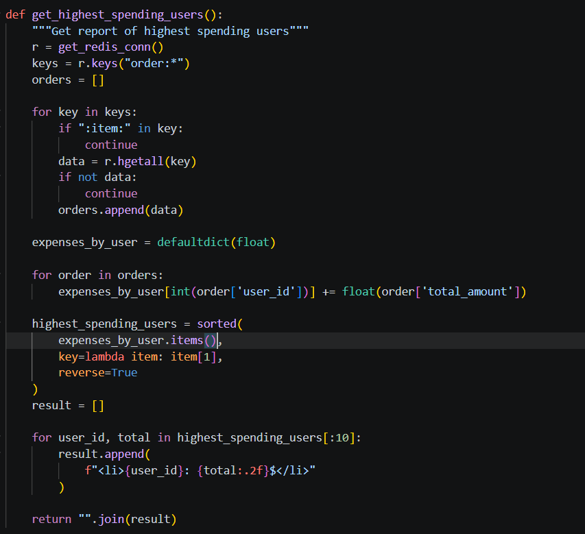

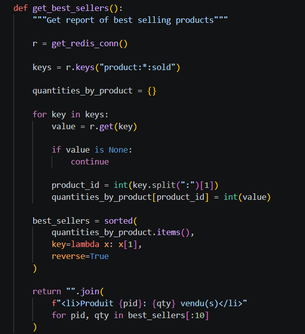
# Déploiement
(Le cas échéant, décrivez votre pipeline CI/CD et ce que vous avez appris dans ce laboratoire en ce qui concerne le déploiement. Il est obligatoire d'ajouter du code, des captures d'écran ou des sorties de terminal pour illustrer votre réponse.)

La complexité du déploiement et le manque de repères dans ce domaine empêche l'apprentissage profond de la matière. Quant au déploiement, le CI déployé est plus défensif que le précédent étant donné qu'il adresse les problèmes potentiels de réutilisation de containers ou d'images Docker et élimine toutes  données résiduelles Redis et MySQL des anciens runs. 

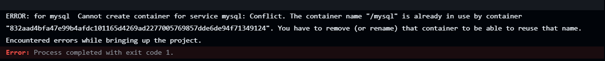
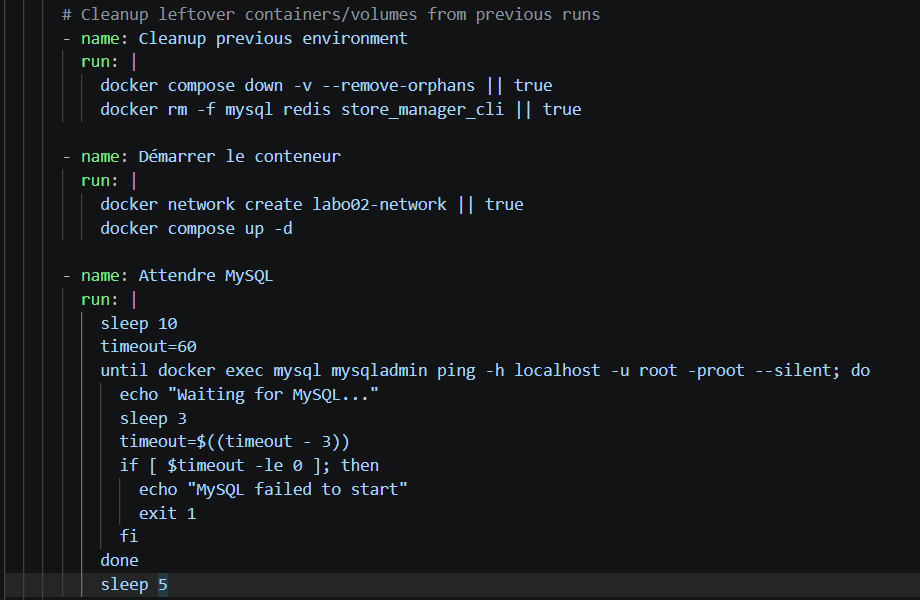
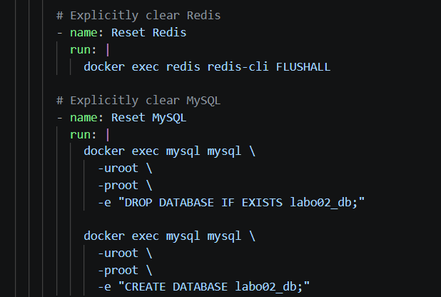

Le déploiement devait aussi palier le problème étrange que les tests réussissent lorsque faits localement, mais pas sur le serveur.
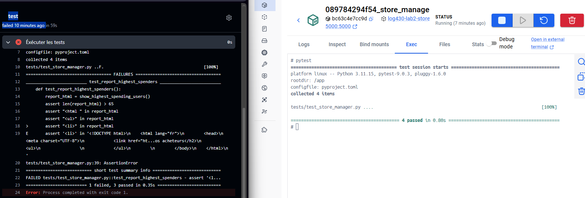

Ce laboratoire a néanmoins permis de voir la différence entre l'accès direct à la base de données avec MySQL comparée à l'utilisation d'un DAO comme intermédiaire.